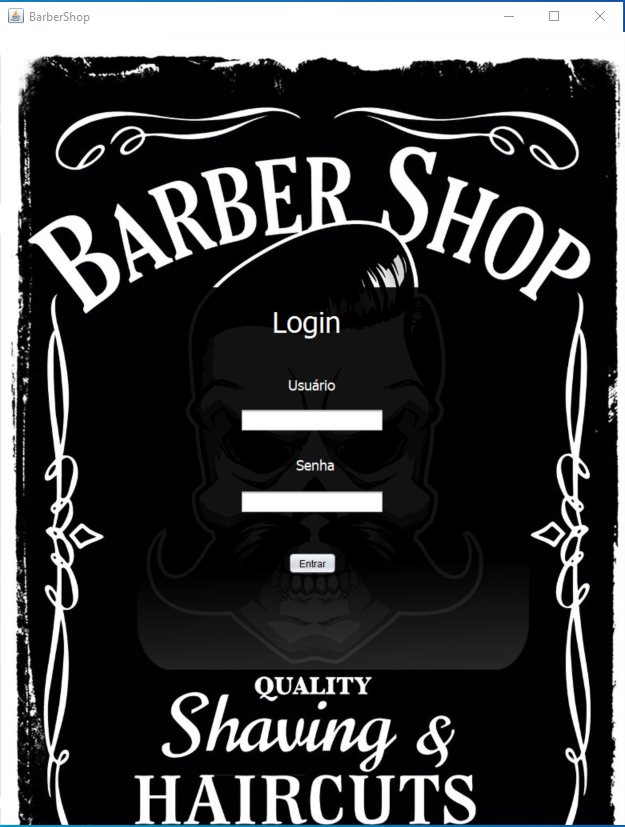
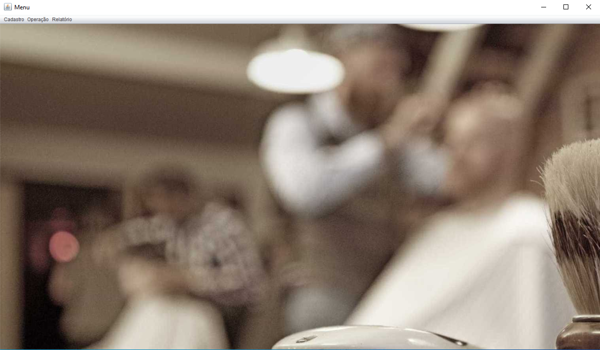
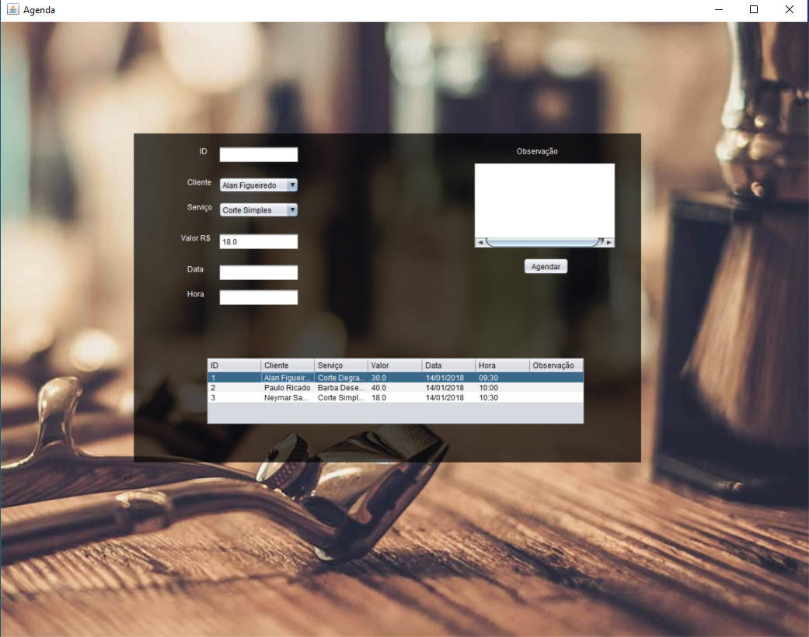

# Projeto-Barbearia

Nesse sistema de barbearia, o administrador consegue acessar e lançar agendamentos. Além de enviar um e-mail para seu cliente
confirmando o agendamento.
Não foi utilizado banco de dados, sim um arrayList. 

Foi utilizado o paradigma de orientação a objetos e Jframes para a parte visual.
O projeto seguiu o padrão de arquitetura MVC.

Para fazer login:
usuário: barbeiro senha: barbeiro

Feito a partir de curso no youtube: https://www.youtube.com/playlist?list=PLJIP7GdByOyuBKB--fIO2DoQaPVXm9lCw
Créditos: Tiago Luz

